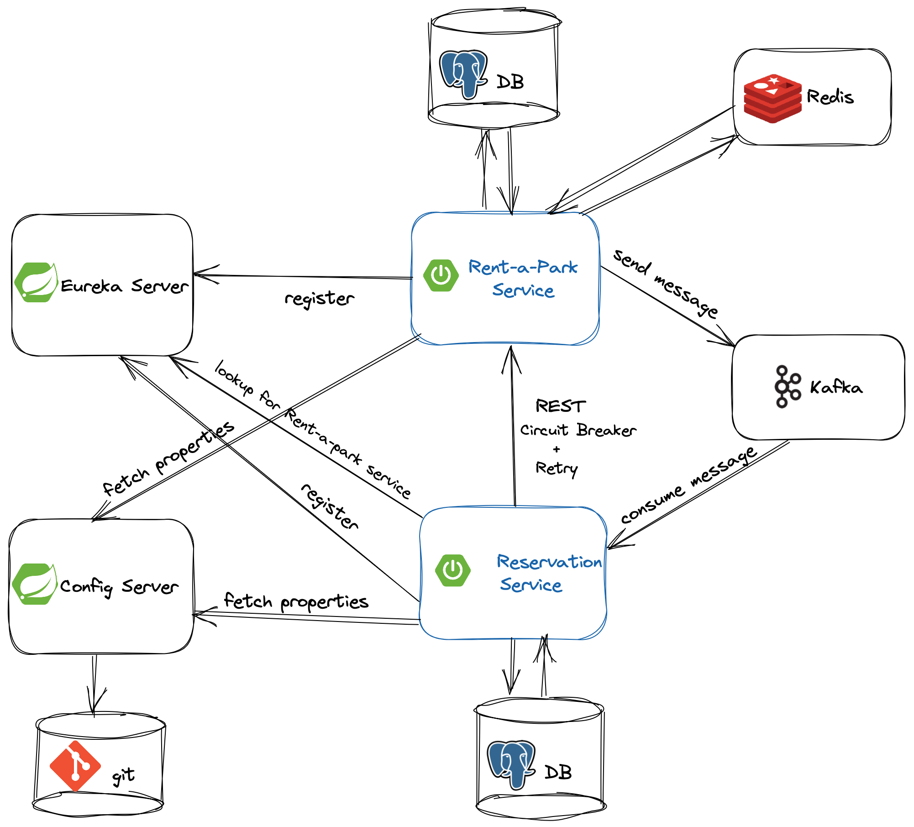

# Rent-a-Park

## Content

### Technologies 

* Java
* Spring Boot, Spring Cloud
* PostgreSQL
* Redis
* Docker
* Kafka

### Features
* Create, update, delete and list parking spots
* Create, update, delete and list persons
* Make reservation for parking spot on [Reservation Service](https://github.com/Code-Of-Us/Reservation-Service)
* Implemented Redis cache for caching user information, evicting when the update is done
* Used Test Containers in integration tests for setting up Redis, Postgres and Eureka containers

### CI/CD

* GitHub actions for Continuous Integration (CI)
  * Build with CodeCov
  * Code Analysis with SonarCloud
  * Build and push Docker image to GitHub Container Registry
  * Public GitHub package
  * Docker file
  * Docker compose file for setting up external services like Postgres, Redis, Prometheus, Grafana and Eureka

#### Monitoring
* Prometheus for collecting and storing metrics
* Grafana for visualizing and analyzing metrics

### Microservice architecture
* Eureka server - Service Registry and Client-side service discovery using Eureka
* Feign Client

